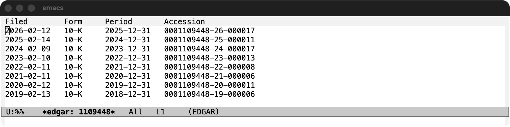
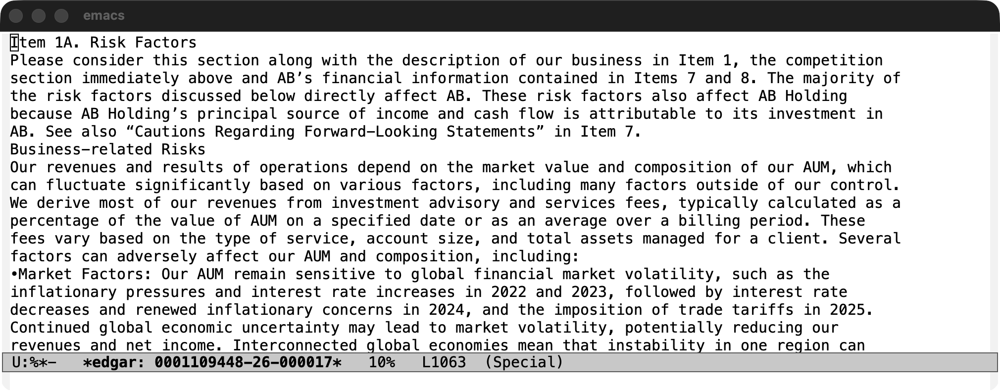
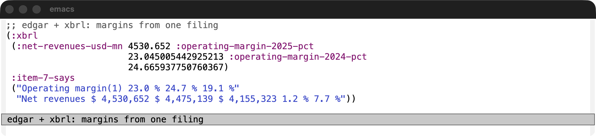
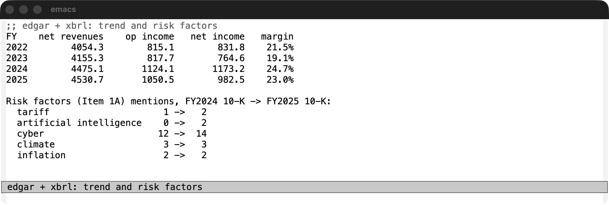
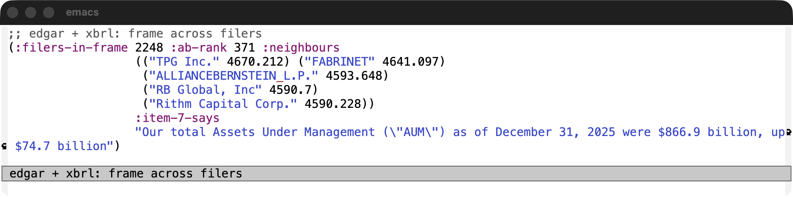

# Showcase: one annual report, two libraries

`edgar.el` knows what a filing *is*: which filings a company has, and the text of
each Item. [`xbrl.el`](https://github.com/davidawad/xbrl.el) knows what a filing
*states*: tagged numbers. Neither duplicates the other, so a question like "what
margin does management report, and what is it from the tagged numbers?" takes
both. These four examples answer such questions about **AllianceBernstein L.P.**
(CIK 1109448), using its Form 10-K for fiscal 2025 (filed 2026-02-12).

Which registrant: the ticker `AB` is **AllianceBernstein Holding L.P.** (CIK
825313), a separate registrant that files its own 10-K with nearly the same text.
Holding's only income is its stake in the operating partnership, and the SEC API
has no `Revenues` or `OperatingIncomeLoss` for it (404). **AllianceBernstein
L.P.** carries the operating numbers, and both libraries accept a numeric CIK, so
that is the one used here (it has no ticker, hence `1109448` below).

Every number and string on this page is real output from SEC responses
(fetched 2026-10-03). The same filing is recorded in `test/fixtures/10-k-ablp.*`,
and `test/edgar-showcase-test.el` asserts the margins and Item text offline
against real recorded SEC payloads. Screenshots are a GUI Emacs window (Emacs
30.2, macOS) captured with `screencapture`.

## Setup

```elisp
(setq xbrl-user-agent "Your Name you@example.com") ; SEC requires this
(defvar ab-cik 1109448) ; AllianceBernstein L.P., the operating partnership
(defvar ab (edgar-latest ab-cik "10-K"))
(defvar ab-sections (edgar-sections (edgar-text ab)))

(defun ab-year (concept year)
  "AB's 10-K value of us-gaap CONCEPT for the fiscal year ending in YEAR."
  (plist-get
   (seq-find (lambda (f) (string-prefix-p (format "%d" year) (plist-get f :end)))
             (xbrl-annual ab-cik concept))
   :val))

(defun ab-grep (key regexp)
  "First text matching REGEXP in section KEY, whitespace collapsed."
  (let ((body (cdr (assoc key ab-sections))))
    (when (string-match regexp body)
      (string-trim
       (replace-regexp-in-string "[ \t\n]+" " " (match-string 0 body))))))
```

`xbrl-annual` returns the latest-filed 10-K value per fiscal year from the SEC
companyconcept API, so `ab-year` is one call per concept.

## 1. List the annual filings, then look at their Items

`M-x edgar-list`, answering `1109448` and `10-K`, browses the filings (RET opens
one):



```elisp
(list
 (mapcar (lambda (f) (list (plist-get f :filed) (plist-get f :report) (plist-get f :accn)))
         (seq-take (edgar-filings ab-cik "10-K") 3))
 (mapcar (lambda (s) (cons (car s) (length (cdr s)))) ab-sections))
```

```elisp
((("2026-02-12" "2025-12-31" "0001109448-26-000017")
  ("2025-02-14" "2024-12-31" "0001109448-25-000011")
  ("2024-02-09" "2023-12-31" "0001109448-24-000017"))
 (("I.1" . 50325) ("I.1A" . 46901) ("I.1B" . 122) ("I.1C" . 5587)
  ("I.2" . 1361) ("I.3" . 1250) ("I.4" . 203) ("II.5" . 5082)
  ("II.6" . 24) ("II.7" . 99100) ("II.7A" . 3823) ("II.8" . 197347)
  ("II.9" . 208) ("II.9A" . 4241) ("II.9B" . 680) ("II.9C" . 249)
  ("III.10" . 46434) ("III.11" . 103053) ("III.12" . 15881)
  ("III.13" . 5103) ("III.14" . 1910) ("IV.15" . 11404)
  ("IV.16" . 2830)))
```

Item keys are Part-qualified (`II.7` is Item 7). `M-x edgar-read` (or
`edgar-open`) shows the rendered report; this is Item 1A, Risk Factors:



## 2. Management's margin next to the margin from tagged numbers

Item 7 prints an operating margin ("operating income excluding net income
attributable to non-controlling interests, as a percentage of net revenues").
The same figure from `xbrl.el` facts, next to the text:

```elisp
(defun ab-operating-margin (year)
  "Operating income less the part owed to non-controlling interests, over net revenues."
  (* 100 (/ (float (- (ab-year "OperatingIncomeLoss" year)
                      (ab-year "NetIncomeLossAttributableToNoncontrollingInterest" year)))
            (ab-year "RevenuesNetOfInterestExpense" year))))

(list :xbrl (list :net-revenues-usd-mn (/ (ab-year "RevenuesNetOfInterestExpense" 2025) 1e6)
                  :operating-margin-2025-pct (ab-operating-margin 2025)
                  :operating-margin-2024-pct (ab-operating-margin 2024))
      :item-7-says (list (ab-grep "II.7" "^Operating margin(1) .*$")
                         (ab-grep "II.7" "^Net revenues .*$")))
```

```elisp
(:xbrl
 (:net-revenues-usd-mn 4530.652 :operating-margin-2025-pct
                       23.045005442925213 :operating-margin-2024-pct
                       24.665937750760367)
 :item-7-says
 ("Operating margin(1) 23.0 % 24.7 % 19.1 %"
  "Net revenues $ 4,530,652 $ 4,475,139 $ 4,155,323 1.2 % 7.7 %"))
```

The facts give 23.05% and 24.67%, which Item 7 prints as 23.0% and 24.7%.



## 3. Trend from the API, plus how the risk factors changed

Four years of tagged facts, then a word count over Item 1A of this filing and of
the previous one (`edgar-section` takes the bare `"1A"`). This uses
`ab-operating-margin` from example 2.

```elisp
(defun ab-count (regexp text)
  (with-temp-buffer
    (insert text)
    (goto-char (point-min))
    (let ((n 0)) (while (re-search-forward regexp nil t) (cl-incf n)) n)))

(let ((risk-prev (edgar-section (nth 1 (edgar-filings ab-cik "10-K")) "1A"))
      (risk-now (cdr (assoc "I.1A" ab-sections))))
  (concat
   (format "%-5s %12s %12s %12s %8s\n" "FY" "net revenues" "op income" "net income" "margin")
   (mapconcat
    (lambda (year)
      (let ((rev (ab-year "RevenuesNetOfInterestExpense" year))
            (op (ab-year "OperatingIncomeLoss" year))
            (ni (ab-year "NetIncomeLoss" year)))
        (format "%-5d %12.1f %12.1f %12.1f %7.1f%%" year (/ rev 1e6) (/ op 1e6) (/ ni 1e6)
                (ab-operating-margin year))))
    '(2022 2023 2024 2025) "\n")
   "\n\nRisk factors (Item 1A) mentions, FY2024 10-K -> FY2025 10-K:\n"
   (mapconcat
    (lambda (term)
      (format "  %-24s %3d -> %3d" term (ab-count term risk-prev) (ab-count term risk-now)))
    '("tariff" "artificial intelligence" "cyber" "climate" "inflation") "\n")))
```

```
FY    net revenues    op income   net income   margin
2022        4054.3        815.1        831.8    21.5%
2023        4155.3        817.7        764.6    19.1%
2024        4475.1       1124.1       1173.2    24.7%
2025        4530.7       1050.5        982.5    23.0%

Risk factors (Item 1A) mentions, FY2024 10-K -> FY2025 10-K:
  tariff                     1 ->   2
  artificial intelligence    0 ->   2
  cyber                     12 ->  14
  climate                    3 ->   3
  inflation                  2 ->   2
```



## 4. A frame across filers, next to a section

`xbrl-frame` returns one concept for every filer. AB's 2025 `Revenues` (gross,
before interest expense, so a little above the net revenues in example 2) is
ranked in the `us-gaap` frame for calendar 2025 and shown with its neighbours,
next to Item 7's own assets-under-management sentence:

```elisp
(let* ((frame (sort (copy-sequence (xbrl-frame "us-gaap" "Revenues" "USD" "CY2025"))
                    (lambda (a b) (> (plist-get a :val) (plist-get b :val)))))
       (rank (1+ (seq-position frame (ab-year "Revenues" 2025)
                               (lambda (r v) (= (plist-get r :val) v))))))
  (list :filers-in-frame (length frame)
        :ab-rank rank
        :neighbours (mapcar (lambda (r) (list (plist-get r :entityName) (/ (plist-get r :val) 1e6)))
                            (seq-subseq frame (- rank 3) (+ rank 2)))
        :item-7-says (ab-grep "II.7" "Our total Assets Under Management\\(?:.\\|\n\\)*?billion, up \\$[0-9.]+\\(?:.\\|\n\\)*?billion")))
```

```elisp
(:filers-in-frame 2248 :ab-rank 371 :neighbours
                  (("TPG Inc." 4670.212) ("FABRINET" 4641.097)
                   ("ALLIANCEBERNSTEIN L.P." 4593.648)
                   ("RB Global, Inc" 4590.7)
                   ("Rithm Capital Corp." 4590.228))
                  :item-7-says
                  "Our total Assets Under Management (\"AUM\") as of December 31, 2025 were $866.9 billion, up $74.7 billion")
```



## Limits seen while writing this

- The frame mixes every kind of filer and fiscal year end; neighbours by revenue
  are not peers. Large asset managers (BlackRock, T. Rowe Price) were not in
  the `Revenues` frame (I did not investigate why).
- `ticker` arguments resolve through the SEC ticker file, which lists only
  Holding under `AB`; the operating partnership needs its CIK.
- Item bodies are rendered HTML, running text and page numbers included, not
  cleaned prose.
